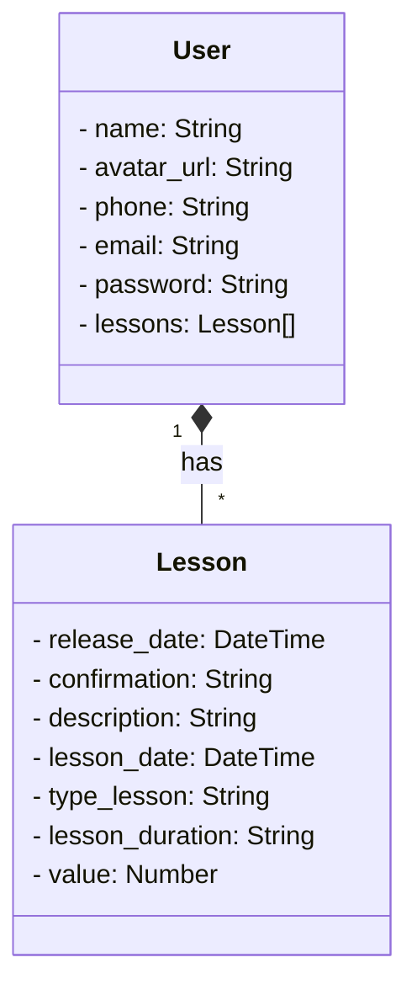

# ApiResFull

## Diagrama de calsses 

```mermaid
classDiagram
  class User {
    - name: String
    - avatar_url: String
    - phone: String
    - email: String
    - password: String
    - lessons: Lesson[]
  }

  class Lesson {
    - release_date: DateTime
    - confirmation: String
    - description: String
    - lesson_date: DateTime
    - type_lesson: String
    - lesson_duration: String
    - value: Number
  }

  User "1" *-- "*" Lesson : has

```
